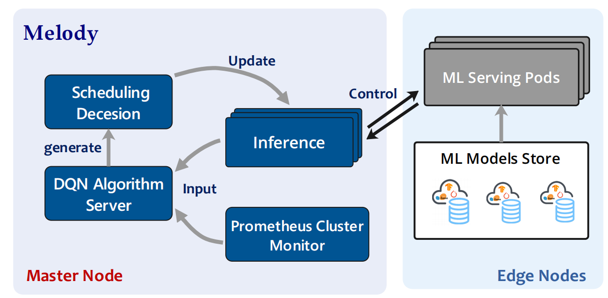

# Melody: Machine Edge Learning and Dynamic Scheduling 
Melody is an online scheduling framework for 
edge computing ML model inference on Kubernetes. 
<h1 align="center">
    
</h1>

## Overview
Melody uses Deep Q-learning as the base scheduling algorithm, use prometheus to monitor Edge computing resources and input metrics to DQN, and obtain the optimal scheduling strategy.

<h1 align="center">
    
</h1>

## Features
key benefits include:
- Support auto-scheduling ML inference pods between edge nodes.
- Continuously balance the computing resources (cpu, memory) on edge nodes.
- Consider the local model store for online serving jobs.
- Equipped with DQN reinforcement learning algorithm to obtain the balanced scheduling strategy.

## Get Started