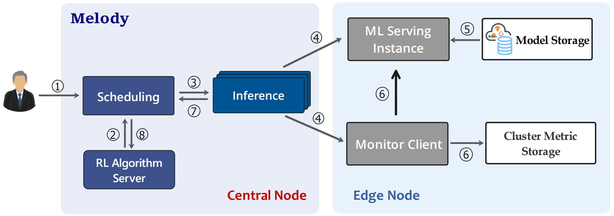

# Melody: ML Edge Inference with Dynamic Scheduling 
Melody is a framework for intelligent scheduling for
edge computing ML inference instances on Kubernetes. 

## Overview
Melody uses Deep Reinforcement Learning as the scheduling algorithm, use prometheus to monitor Edge computing resources and input metrics to DQN, and obtain the optimal scheduling strategy.

## Features
key benefits include:
- Support auto-scheduling ML inference instances between edge nodes.
- Continuously balance the computing resources (cpu, memory) on edge nodes.
- Equipped with reinforcement learning algorithm to obtain the balanced scheduling strategy.

## Custome Resource Definition(CRD)
- Inference define the ML inference jobs, it observes the scheduling decesion CRD, and dynamic adjust the resource limit and request. 
- Scheduling defines the scheduling strategy by communicating with  RL algorithm server, it defines the optimal edge node for each ML serving instance Job.
## Get Started
